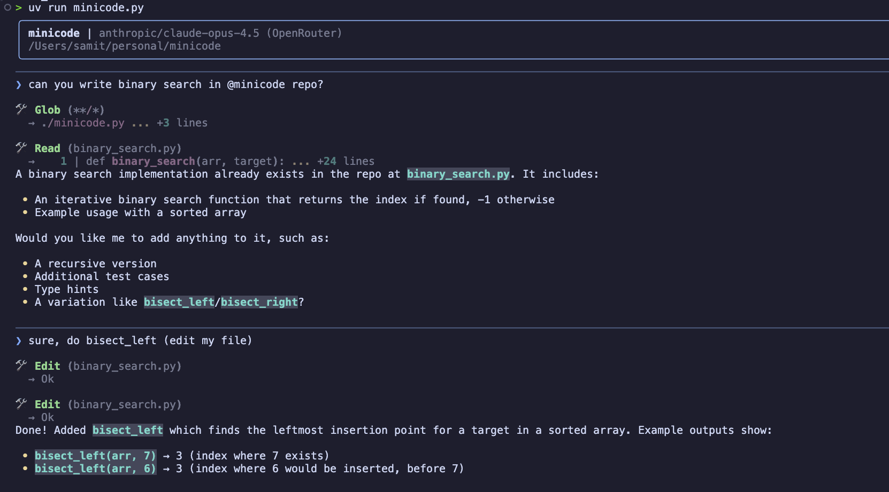

Building my own claude code because I don't trust Anthropic no more.



Clone, put your key and run, no pip install shit. Stdlib only, Python 3.7+.

## Setup

- Open the config file: nano ~/.zshrc
- Add the export line to the bottom: export OPENROUTER_API_KEY="sk-or-..."
- Save and exit (Ctrl+O, Enter, Ctrl+X).
- Reload the config: source ~/.zshrc

Set `ANTHROPIC_API_KEY` instead to hit the Anthropic API directly. `MODEL`
overrides the model on either.

## Run

```
python3 minicode.py
```

Commands: `/q` or `exit` to quit, `/c` to clear the conversation. Ctrl-C
cancels the current turn, Ctrl-D quits.

## Tools

The model gets six: `read`, `write`, `edit`, `glob`, `grep`, `bash`.

## It runs commands on your machine

`bash`, `write` and `edit` ask for confirmation before running. Everything the
model reads can carry an instruction, so a file in a repo you cloned can try to
talk it into something. The prompt is the only thing between that and your
shell.

```
python3 minicode.py --yolo
```

turns the confirmations off. It runs whatever the model emits, as you, in the
current directory. Use it when you already know what the thing is about to do.
